<p align="center"> 
    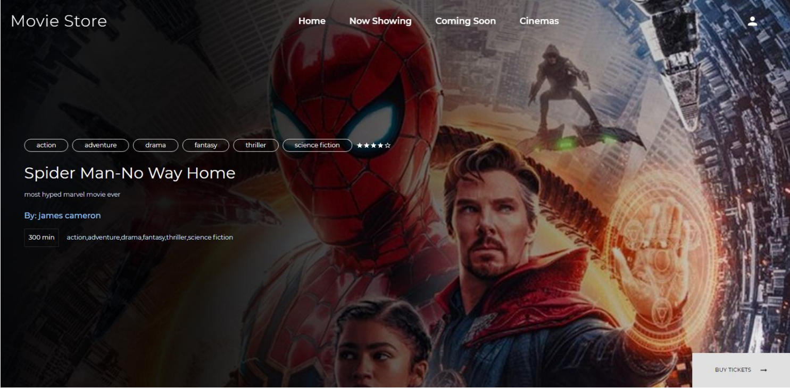</img>
</p>

<h1 align="center"> Movie Store 🛒📽️ </h1> 
<h3 align="center"> Seamlessly book your movie tickets anytime, anywhere with our smart and dynamic booking platform! </h3>

<p align="center">
    <a href="https://reactjs.org/"></a>
    <a href="https://redux.js.org/"></a>
    <a href="https://nodejs.org/"></a>
    <a href="https://expressjs.com/"></a>
    <a href="https://www.mongodb.com/"></a>
    <a href="https://mui.com/"></a>
    <a href="https://sass-lang.com/"></a>
    <a href="https://mongoosejs.com/"></a>
    <a href="https://www.npmjs.com/package/jsonwebtoken"></a>
    <a href="https://www.npmjs.com/package/multer"></a>
    <a href="https://github.com/eligrey/FileSaver.js/"></a>
    <a href="https://momentjs.com/"></a>
    <a href="https://www.chartjs.org/"></a>
</p>


<!-- <p align="center">If you want to discuss something, you can ask on my <a href="https://discord.com/invite/GkcbM5bwZr">Discord Server</a>.</p> -->

# 🖥️ Installation & Setup ⚙️

- Download the latest Node.js version from [here](https://nodejs.org/en/download/) and npm will be installed with nodejs.

- Clone the repository

  ```sh
  git clone <repo_link>
  ```

- Navigate to the project directory
- Install the required dependencies
  ```sh
  npm install
  ```
- Start the app
  
  - Runs the react app in the development mode.\
    Open [http://localhost:3000](http://localhost:3000) to view it in your browser.
    ```sh
     npm run client
    ```
  - Runs the backend server app in the development mode.\
    Open [http://localhost:8080](http://localhost:8080) 
      ```sh
     npm run server
    ```

# ▶️ App Features

## 🎬 User Page
- **Browse Movies**: Users can easily explore a vast collection of movies based on genres, languages, and release dates.
  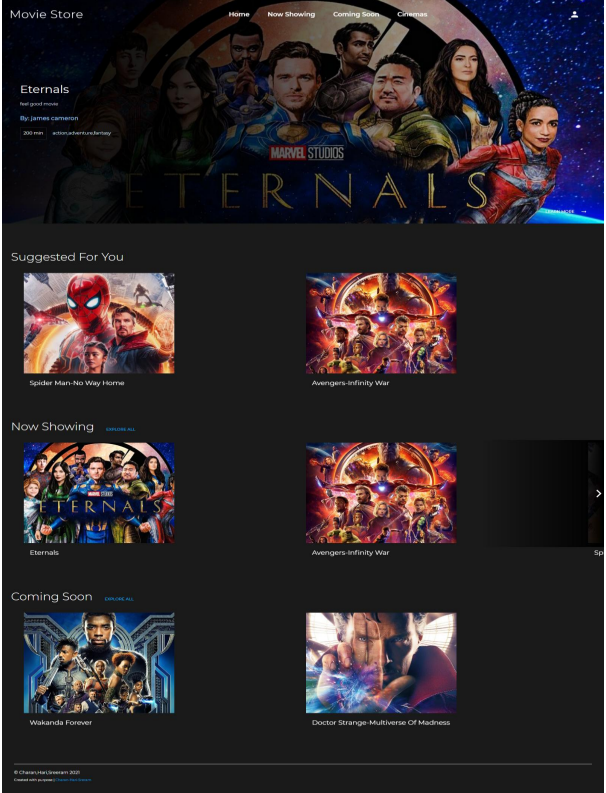
  


- **Select Showtimes**: Choose preferred showtimes and cinema locations based on availability.
  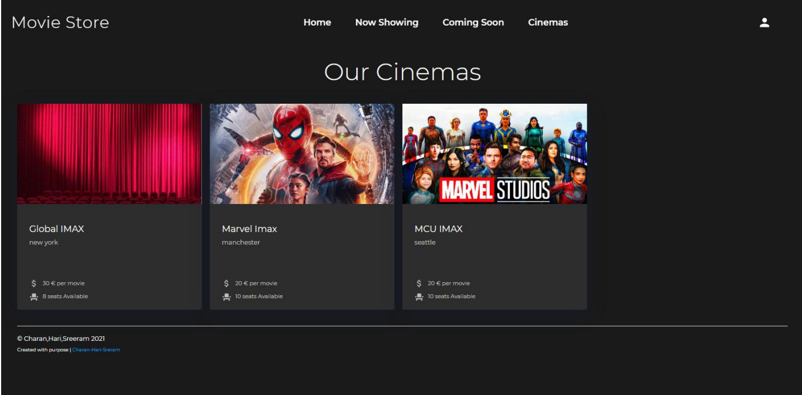

- **Seat Selection**: View the seating arrangement and select desired seats in real-time.
  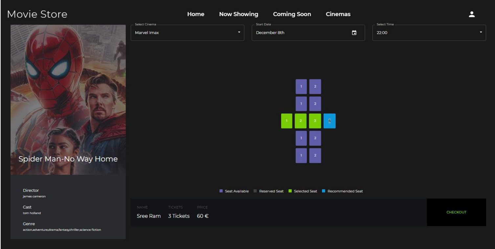

- **Booking Confirmation**: Receive booking confirmation with a summary of selected seats, showtime, and cinema location.
  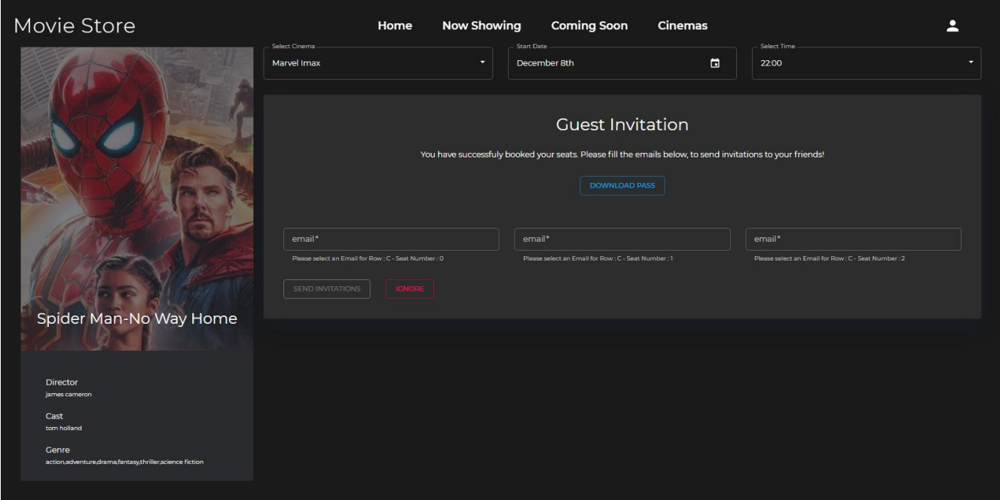

- **User Dashboard **: Secure login and registration for users, check reservation history, and manage personal information.
  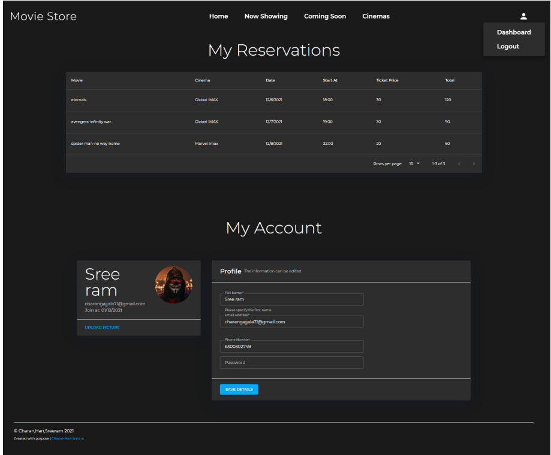


## 🎟️ Admin Dashboard
- **Dashboard for Theatre Owners**: Theatre admins can manage their cinema information, view reservations, and analyze booking statistics.
  
- **Add Movies**: Admins can easily add new movies to their cinemas and manage showtimes and seat availability.
  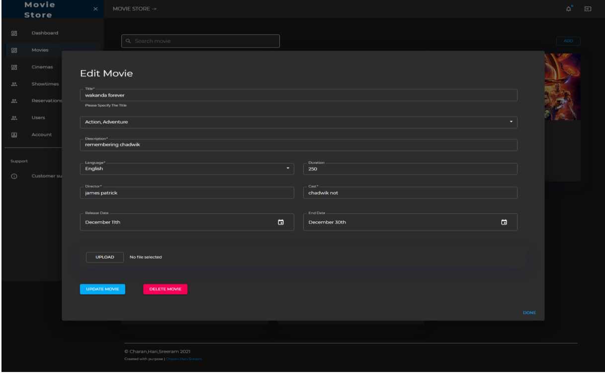
  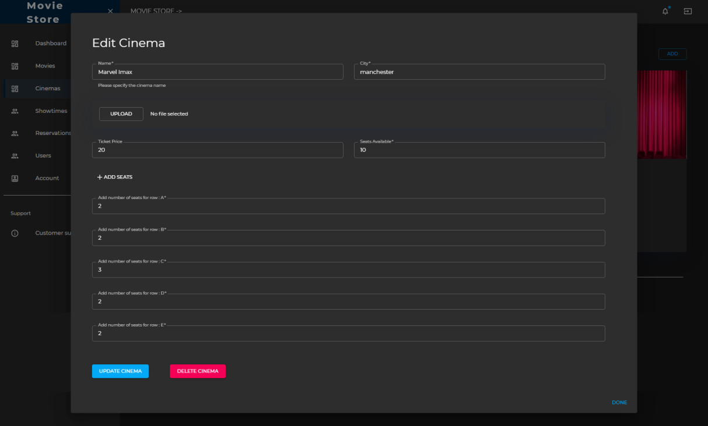
  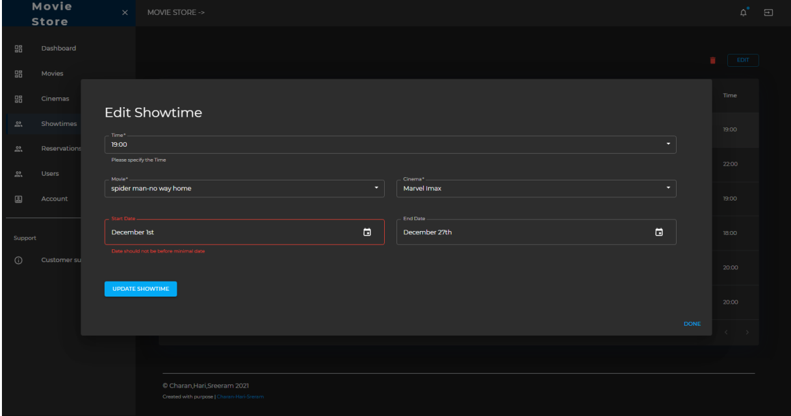
- **Reservation Management**: Admins can track all bookings, manage seat statuses, and handle ticket cancellations.
  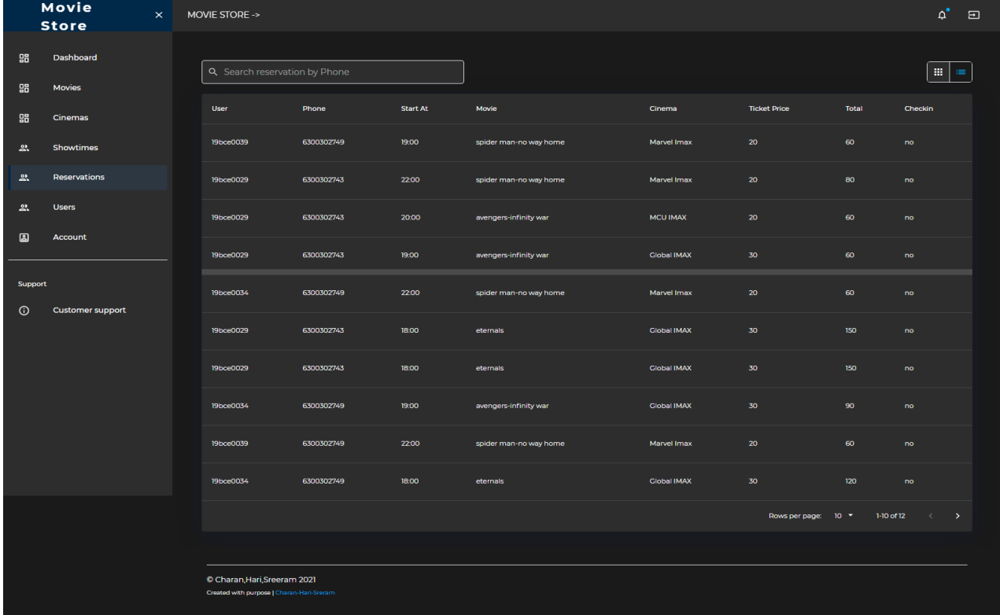
  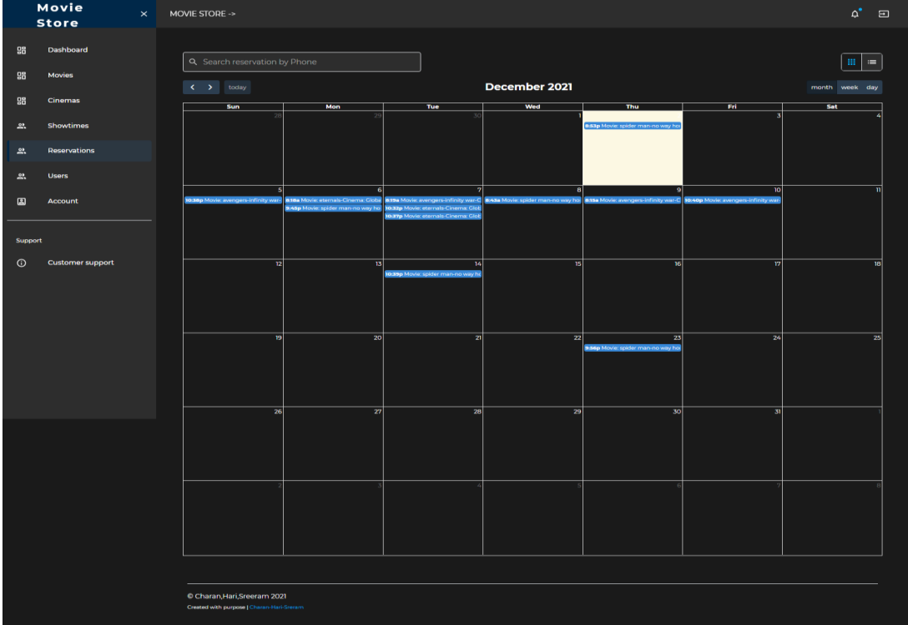
- **Business Analytics**: Admin dashboard provides rich visualizations and statistical insights into bookings, sales, and customer behavior.
  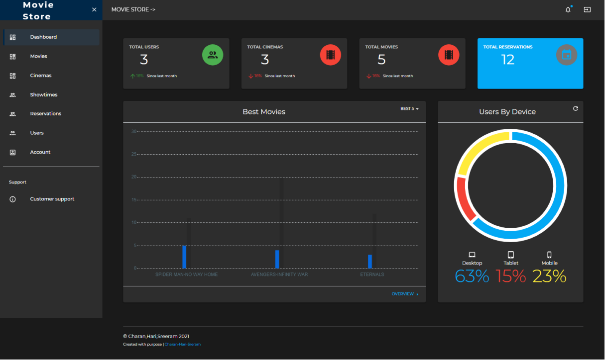

## 💳 Future Scope
- **Payment Integration**: Integration with payment gateways to facilitate online transactions for booking tickets.
- **Customer Reviews**: Allow users to leave reviews and feedback for movies they have watched.
- **Offers & Promotions**: Admins can create and manage promotional offers for movie bookings.

# Tech Stack 📃
- **Frontend**: React.js with Material-UI for creating a responsive and dynamic user interface.
- **Backend**: Node.js and Express.js for server-side logic, REST API endpoints, and business logic.
- **Database**: MongoDB (Atlas cloud cluster) for storing user, movie, and reservation data.
- **State Management**: Redux for managing application state and ensuring smooth UI updates across different components.
- **Data Validation**: `validator.js` library ensures that user inputs, such as email and phone numbers, are validated for correctness and security.


# 🚀 Technical Details

## 💡 High-level System Architecture


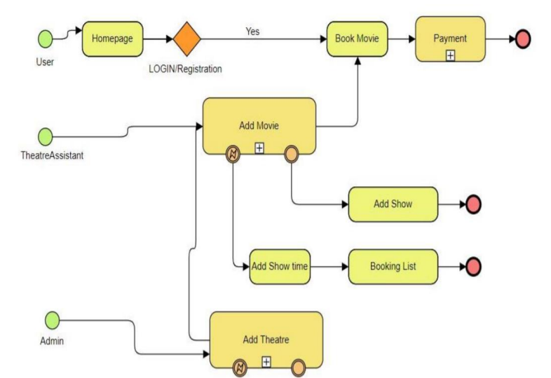

## Low-level Implementation Details 👨‍💻
### 1. Authentication Module
- **User Roles**: Three user roles are implemented: Guest, Admin, and Super Admin.
  - **Guest**: General users who can browse movies, select showtimes, and book tickets.
  - **Admin**: Theatre owners with access to manage cinemas, movies, and reservations.
  - **Super Admin**: Application owner with full control over admin approval, user management, and analytics.
  
### 2. Movie Module
- **Movie Management**: Admins can add and edit movies, including title, cast, director, genre, and release dates. All movie data is stored in a MongoDB collection.
- **Schema**: Movie schema includes fields like `title`, `cast`, `director`, `genre`, `releaseDate`, and `endDate`.
- **Movie Carousel & Listings**: Frontend displays movies in carousels (e.g., "Now Showing" and "Coming Soon") and lists them dynamically based on user interactions and selections.

### 3. Cinema Theatre Module
- **Cinema & Seat Management**: Admins can create cinemas, define seat arrangements, set ticket prices, and manage seat availability.
- **Schema**: Cinema schema includes fields like `name`, `location`, `seats`, `ticketPrice`, and `seatsAvailable`.
- **Seating Arrangement**: Seat layout is rendered as a graphical grid, allowing users to choose specific seats during the booking process.

### 4. ShowTime Module
- **Showtime Scheduling**: Admins assign movies to specific cinemas with start and end dates for showtimes.
- **Schema**: Showtime schema links `movieId` and `cinemaId` and includes `startDate`, `endDate`, and `showtimes`.
- **Seat Reservation**: The system tracks booked and available seats for each showtime.

### 5. Booking Module
- **User Flow**: Users select their desired movie, cinema, and showtime, then proceed to the seat selection interface.
- **Graphical Seat Layout**: Users can visually select their seats in real-time.
- **Booking Confirmation**: After seat selection, users are presented with a booking summary page before confirming the reservation.
- **Reservation Schema**: Reservations are saved in MongoDB, with fields like `movieId`, `cinemaId`, `showtime`, `seats`, `ticketPrice`, and `total`.

### 6. Admin and Super Admin Module
- **Dashboard Overview**: Admin and Super Admin users have access to dashboards that provide insights into bookings, seat utilization, and cinema performance.
- **Admin Management**: Super Admins have additional privileges to approve theatre owners as Admins.
- **Analytics**: The admin dashboard includes graphical visualizations to track revenue, movie popularity, and user engagement.

# Contributors 

<table>
  <tbody>
    <tr>
      <td align="center">
        <a href="https://github.com/charangajjala" target="_blank">
          
          <br />
          <sub><b>Charan Gajjala Chenchu</b></sub>
        </a>
      </td>
      <td align="center">
        <a href="https://www.linkedin.com/in/chinna-hari-krishna-reddy-708536245/"
          target="_blank">
          
          <br />
          <sub><b>Chinna Hari Krishna</b></sub>
        </a>
      </td>
            <td align="center">
        <a href="https://www.linkedin.com/in/sree-ram-varma-chintalapati-37092a1a9/"
          target="_blank">
          
          <br />
          <sub><b>Chitalapati Sree Ram Varama</b></sub>
        </a>
      </td>
  </tbody>
</table>

# 🎟️ License

This project is licensed under the MIT License - see the [License](LICENSE) file for details.

# 📜 References & Acknowledgement

1. [React Documentation](https://reactjs.org/)  
   Official documentation for React.js, a JavaScript library for building user interfaces.
   
2. [Material-UI Documentation](https://mui.com/)  
   Material-UI is a popular React UI framework for implementing Google's Material Design.

3. [Express Documentation](https://expressjs.com/)  
   Documentation for Express.js, a fast, minimalist web framework for Node.js.

4. [Mongoose Documentation](https://mongoosejs.com/)  
   Mongoose is an Object Data Modeling (ODM) library for MongoDB and Node.js.

5. [bcrypt.js Documentation](https://www.npmjs.com/package/bcryptjs)  
   bcrypt.js is a library for hashing passwords and ensuring secure storage in the database.

6. [JWT (jsonwebtoken) Documentation](https://www.npmjs.com/package/jsonwebtoken)  
   JSON Web Tokens (JWT) are used to securely transmit information between parties.

7. [Redux Documentation](https://redux.js.org/)  
   Redux is a predictable state container for JavaScript applications, often used with React.

8. [Moment.js Documentation](https://momentjs.com/)  
   Moment.js is a popular library for parsing, validating, manipulating, and formatting dates.

9. [MongoDB Atlas](https://www.mongodb.com/cloud/atlas)  
   MongoDB Atlas is a fully managed cloud database service built for modern applications.

10. [Node.js Documentation](https://nodejs.org/en/docs/)  
    Node.js is a JavaScript runtime built on Chrome's V8 JavaScript engine.

11. [Multer Documentation](https://www.npmjs.com/package/multer)  
    Multer is a middleware for handling multipart/form-data, used for file uploads in Node.js applications.

12. [Chart.js Documentation](https://www.chartjs.org/)  
    Chart.js is a simple yet flexible JavaScript charting library for designers and developers.

13. [Google GeeksForGeeks - Design Movie Ticket Booking System](https://www.geeksforgeeks.org/design-movie-ticket-booking-system-like-bookmyshow/)  
    A tutorial for designing a movie ticket booking system similar to BookMyShow.

14. [GitHub - MovieStore Code Repository](https://github.com/charangajjala/MovieStore)  
    The GitHub repository for the source code of the Movie Ticket Booking System project.